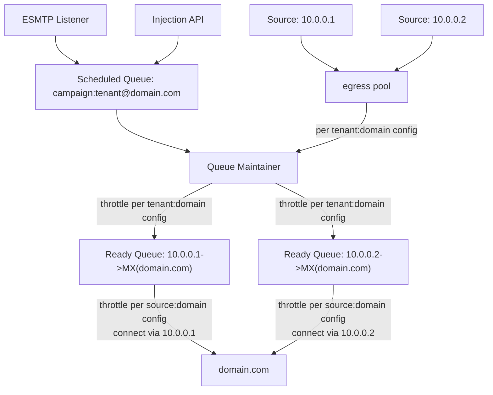

# Queues, Sources, Pools

Messages are assigned to a **Scheduled Queue** upon reception. The system can support
arbitrarily named queues but the convention is to construct the queue name from
some metadata associated with the message:

* `tenant` - some kind of sender or customer identifier or identity derived
  either from the message itself or authentication of the injection session.
* `campaign` - a sender-provided label that can be used to logically group a set
  of related messages, perhaps generated from the same campaign.
* destination domain - the site where the email will be routed
* `routing_domain` - {{since('2023.08.22-4d895015', inline=True)}} overrides the destination domain
  for routing purposes.

These three pieces of information are combined to produce the name of the queue
in the form `campaign:tenant@domain`. You don't need to explicitly assign
a campaign or a tenant. The queue name will be formed based on what is set:

|`tenant` set?|`campaign` set?|`routing_domain` set?|Resulting queue name                     |
|-----------|-----------------|---------------------|-----------------------------------------|
| yes       | yes             |no                   | `campaign:tenant@domain`                |
| yes       | yes             |yes                  | `campaign:tenant@domain!routing_domain` |
| yes       | no              |no                   | `tenant@domain`                         |
| yes       | no              |yes                  | `tenant@domain!routing_domain`          |
| no        | yes             |no                   | `campaign:@domain`                      |
| no        | yes             |yes                  | `campaign:@domain!routing_domain`       |
| no        | no              |no                   | `domain`                                |
| no        | no              |yes                  | `domain!routing_domain`                 |


At reception, in your
[smtp_server_message_received](events/smtp_server_message_received.md) event,
you have the opportunity to set `tenant` and `campaign` meta values, if
desired. By default, the queue associated with the message will be formed from
those values as described above.

You may also explicitly set the queue meta value directly.

This is useful in some special cases. For example, there is a special `null` queue
that simply discards any messages assigned to it, which is useful when implementing
a sink for testing purposes:

```lua
kumo.on('smtp_server_message_received', function(msg)
  -- Accept and discard all messages
  msg:set_meta('queue', 'null')
end)
```

## Egress Sources and Pools

Once assigned to a Scheduled Queue, the system will attempt to deliver it.
The first stage is to resolve the configuration for the queue by triggering
the [get_queue_config](events/get_queue_config.md) event.

One of the queue configuration parameters is the name of the *Egress Pool*
which should be used when delivering messages.

A pool is a group of *Egress Sources*. Each source can be associated with
a local IP address or configured to use an alternative destination port
(and in the future: use the HAProxy protocol) as the source of the outgoing
traffic to the destination domain.

```lua
kumo.on('init', function()
  kumo.define_egress_source {
    name = 'ip-1',
    source_address = '10.0.0.1',
  }
  kumo.define_egress_source {
    name = 'ip-2',
    source_address = '10.0.0.2',
  }
  kumo.define_egress_source {
    name = 'ip-3',
    source_address = '10.0.0.3',
  }

  kumo.define_egress_pool {
    name = 'pool1',
    entries = {
      { name = 'ip-1' },
    },
  }
  kumo.define_egress_pool {
    name = 'pool2',
    entries = {
      { name = 'ip-2', weight = 2 },
      -- we're warming up ip-3, so use it less frequently than ip-2
      { name = 'ip-3', weight = 1 },
    },
  }
end)

local TENANT_TO_POOL = {
  ['tenant-1'] = 'pool1',
  ['tenant-2'] = 'pool2',
  ['tenant-3'] = 'pool1',
}

kumo.on(
  'get_queue_config',
  function(domain_name, tenant, campaign, routing_domain)
    return kumo.make_queue_config {
      egress_pool = TENANT_TO_POOL[tenant],
    }
  end
)
```

When a message in a given queue is ready for delivery, it will use the
configured pool to set up an *Egress Path* for the message to reach its
destination. It will pick a source using weighted round robin from the entries
in the pool, and call your
[get_egress_path_config](events/get_egress_path_config.md) event to resolve
options to control how it will do that.

The parameters to that event are:

* *domain* - the destination domain name
* *egress_source* - the selected egress source
* *site_name* - a string deterministically derived from the MX record for *domain*.

The *site_name* concept allows managing traffic more effectively for domains
that have several or even a great many aliases. Rather than treating each
domain as a separate destination, the traffic can be grouped together and
managed more closely to how the receiving site sees it: as one source.

With that in mind, the egress path is internally identified by the combination
of the *egress_source* and the *site_name*.

```lua
-- Build a mapping from a domain name to the "site name"
-- You'll likely want this to list the major domains for which there are
-- several aliases. You only need populate entries for the big aliased
-- domains; you needn't specify any of the aliases here.
local SITE_OF = {}
for _, domain in ipairs { 'gmail.com', 'yahoo.com' } do
  SITE_OF[domain] = kumo.dns.lookup_mx(domain).site_name
end
-- SITE_OF is now equivalent to:
-- local SITE_OF = {
--   ["gmail.com"] = "(alt1|alt2|alt3|alt4)?.gmail-smtp-in.l.google.com",
--   ["yahoo.com"] = "(mta5|mta6|mta7).am0.yahoodns.net"
-- }

-- This table is keyed by either site name or domain name.
-- Site names are looked up first, then domain names.
local SHAPE_BY_DOMAIN = {
  [SITE_OF['gmail.com']] = {
    -- appropriate general configuration when communicating
    -- with any domain that shares gmail.com's MXs
    max_connection_rate = '1000/hr',
  },
  ['example.com'] = {
    -- appropriate general configuration when communicating
    -- specifically with example.com
    max_connection_rate = '10/hr',
  },
}

-- This table is keyed by the tuple of (site_name, source) or (domain, source).
-- Site names are looked up first, then domain names.
-- Values override/overlay those in SHAPE_BY_DOMAIN.
local SHAPE_BY_SOURCE = {
  [{ SITE_OF['gmail.com'], 'ip-1' }] = {
    -- appropriate configuration for your source when communicating
    -- with any domain that shares gmail.com's MXs
    max_message_rate = '1000/hr',
  },
}

function merge_into(src, dest)
  for k, v in pairs(src) do
    dest[k] = v
  end
end

kumo.on('get_egress_path_config', function(domain, egress_source, site_name)
  -- resolve parameters first based on the site, if any,
  -- then based on the domain, if any,
  -- otherwise use the system defaults
  local domain_params = SHAPE_BY_DOMAIN[site_name]
    or SHAPE_BY_DOMAIN[domain]
    or {}
  local source_params = SHAPE_BY_SOURCE[{ site_name, egress_source }]
    or SHAPE_BY_SOURCE[{ domain, egress_source }]
    or {}
  -- compose the source params over the domain params
  local params = {}
  merge_into(domain_params, params)
  merge_into(source_params, params)
  return kumo.make_egress_path(params)
end)
```

## Message Flow



