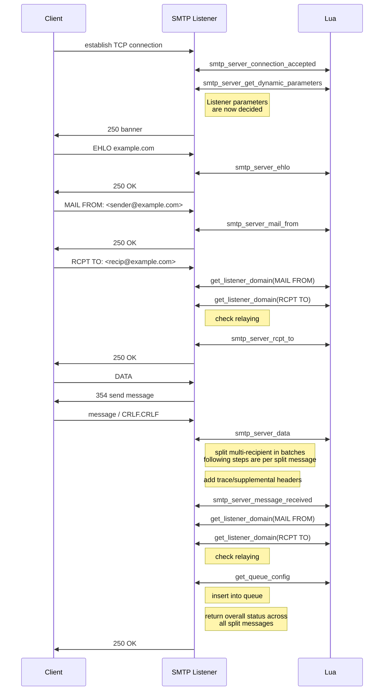

# SMTP Server Events

The following sequence diagram shows the ordering of the various SMTP server
Lua events that are triggered by the SMTP listener in response to SMTP commands
issued by the client.

!!! note
    While the diagram above shows `Lua` as a single actor, each lua event
    callout is likely to run in a distinct, separate, lua context.

Here's a list of links to the docs for the various events in the diagram above,
listed in the same sequence as the diagram:

  * [smtp_server_connection_accepted](events/smtp_server_connection_accepted.md)
  * [smtp_server_get_dynamic_parameters](events/smtp_server_get_dynamic_parameters.md)
  * [smtp_server_ehlo](events/smtp_server_ehlo.md)
  * [smtp_server_mail_from](events/smtp_server_mail_from.md)
  * [get_listener_domain](events/get_listener_domain.md)
  * [smtp_server_rcpt_to](events/smtp_server_rcpt_to.md)
  * [smtp_server_data](events/smtp_server_data.md)
  * [smtp_server_message_received](events/smtp_server_message_received.md)
  * [get_queue_config](events/get_queue_config.md)
