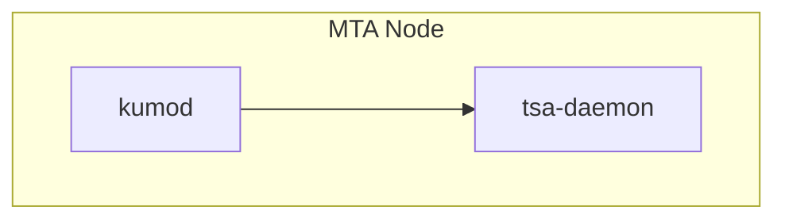
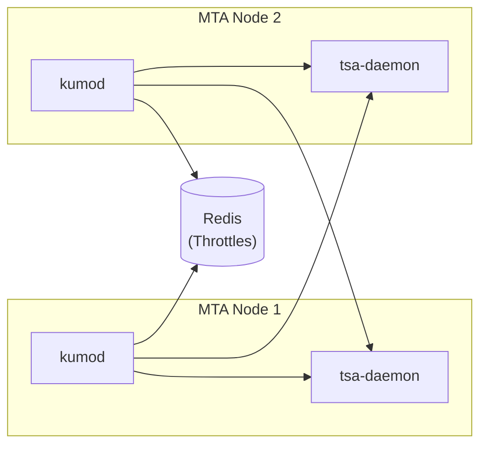
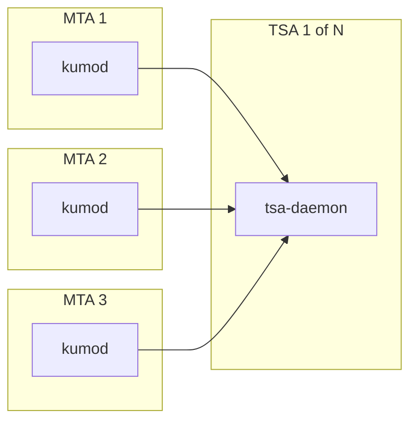
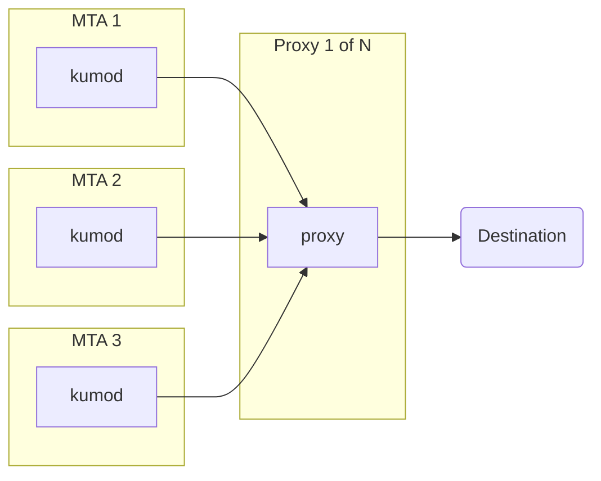

# Deployment Architecture

## Single Node

The functional components for a single node look like this:

* `kumod` is the MTA service
* `tsa-daemon` is the Traffic Shaping Automation daemon, which
  processes log information to feed back and adjust the shaping
  configuration of the MTA.

## Multiple Node

When you have a handful of nodes, you might deploy like this, with
a TSA daemon running locally on each MTA node, and each MTA node
publishing data to all of the TSA daemons.  Throttle state is
stored in redis, which can be deployed in a clustered configuration
if desired:

## Many Nodes

When you have a large number of nodes, you might factor out the TSA
daemon service to a sub-cluster to avoid a full-mesh of log traffic
between all of the nodes, as shown in the diagram below, which omits
the redis portion for the sake of clarity. You would deploy and run
a smaller number of TSA nodes than MTA nodes:

## Proxies for Egress

We recommend the use of a proxy for egress; this allows each node
to have an identical configuration while still being able to use
an appropriate source IP address. This approach results in
a simpler configuration overall and makes it easier to load
balance and scale the deployment up or down.

We support our own SOCKS-5 based proxy implementation as well
as ha-proxy.

