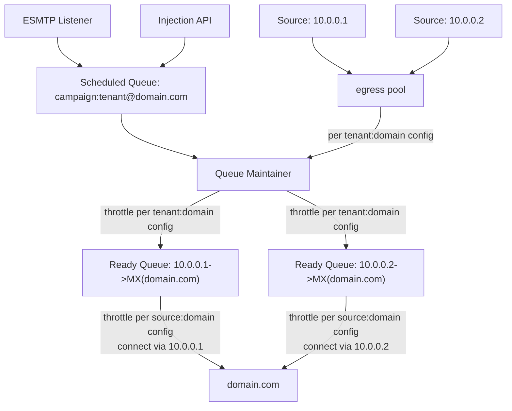

# Configuration Concepts

<iframe width="560" height="315" src="https://www.youtube.com/embed/2jO2isq_YLg?si=6anX9R9RgH2aU2px" title="YouTube video player" frameborder="0" allow="accelerometer; autoplay; clipboard-write; encrypted-media; gyroscope; picture-in-picture; web-share" allowfullscreen></iframe>

KumoMTA uses Lua in place of a more traditional formatted configuration file.

Lua is a surprisingly powerful configuration language, allowing you to either statically define configuration or dynamically build it by pulling from multiple data sources.

While using a scripting language for configuration may sound complicated, in practice many configurations end up being
very succinct and readable.  Take a look at the [example policy](example.md) to
see how a Lua configuration can appear quite similar to a traditional configuration file.

For more information on implementing policies in KumoMTA, refer to the [policy chapter](../policy/index.md).

## Configuration Location

By default, the server will load from `/opt/kumomta/etc/policy/init.lua` on startup. We recommend using this location, but information on starting the server with an alternate path can be found in the chapter on [starting KumoMTA](../operation/starting.md).

## Configuration Scopes

To better understand how a KumoMTA configuration is built, it helps to review the general flow of a message through the KumoMTA server. This is covered in more detail in the [Queues chapter of the reference manual](../../reference/queues.md) but will be summarized here.



1) A message is injected into the KumoMTA server. This is affected by configuring either an [SMTP Listener](./smtplisteners.md) or an [HTTP Listener](./httplisteners.md).

2) The message is assigned into a Scheduled Queue based on the combination of its **campaign,** **tenant,** and destination **domain**. If there is no defined campaign or tenant, the message is placed in a queue based on the elements that are present.

  At this point, the behavior of the queue can be configured to control things such as the age of a message, the retry intervals, and the routing of a message. These options are described in the [Configuring Queue Management](./queuemanagement.md) chapter.

3) The KumoMTA server moves the message from the Scheduled Queue into the Ready Queue based on retry intervals configured for the Standby Queue. If a message is on its first attempt, it will be moved to the Ready Queue immediately.

4) Messages move from the Ready Queue to their destination via an **egress path** that was configured for the Ready Queue. This egress path is defined as a combination of an **egress source** and a **site name**. Traffic shaping and other similar options are configured based on this combination, see the [Configuring Traffic Shaping](./trafficshaping.md) chapter for more information.

  * The **egress source** is a configured structure that defines the name, source IP, and ehlo domain of a given pathway, and it is added to an egress pool, which the message is assigned to as part of the queue config. **Note:** While routing is assigned at the *egress pool* level, traffic shaping happens at the *egress source* level.

  * The **site name** is an identifier string created by merging the combined MX hostnames for a given destination domain. This approach allows the server to queue and throttle based not on the destination domain for a given message, but on the aggregate of all domains that share the same set of MXes.

5) All delivery attempts are logged, and any messages that receive a 4xx tempfail response from the remote host are returned to the Scheduled Queue to await a retry attempt. See the [Configuring Logging](./logging.md) chapter for more information on logging.

## Configuration Structure

There is a lot of flexibility in how a KumoMTA policy file is laid out, but a few things are generally consistent:

### Init Event

The majority of the base server configuration will reside within an init event handler. The init event is fired when the server first starts up, making it the appropriate time for basic server configuration.

Because these attributes are only loaded on init, an explicit reload must be triggered when anything in the init handler is changed, whether the change is in the policy script itself or a change in a data source or file accessed by the policy script.

An example:

```lua
kumo.on('init', function()
  kumo.define_spool {
    name = 'data',
    path = '/var/spool/kumomta/data',
    kind = 'RocksDB',
  }
end)
```

### Realtime Events

Attributes that are needed at the time of queueing and sending are handled in events that are called repeatedly as messages pass through the server. Any such events are constantly firing, and as such any file or data source access involved in those events will update immediately unless caching is configured.

That said, any modification to the policy script itself is subject to caching of the Lua policy, which is refreshed every 300 seconds or 1024 executions by default.

An example:

```lua
kumo.on('get_queue_config', function(domain, tenant, campaign, routing_domain)
  return kumo.make_queue_config {
    egress_pool = tenant,
  }
end)
```

### External Data

Because the configuration is implemented through policy, the traditional practice of breaking things up into discrete files and assembling them using include statements does not apply.

Since includes were often used for dynamic information such as relay domains or relay hosts, the recommended practice is to store that specific data in a data file or data source and load it using Lua data access functions.

For example, DKIM signing information by domain and selector could be stored in a JSON file like this:

```json
{
  "examplecorp.com": "s1024",
  "newcorp.com": "dkim2023"
}
```

The data file could then be read and used to control signing:

```lua
local DKIM_CONFIG = kumo.json_load '/opt/kumomta/etc/policy/dkim_config.json'

function dkim_sign(msg)
  local sender_domain = msg:from_header().domain
  local selector = DKIM_CONFIG[sender_domain]
  -- and so on
end
```

That said, Lua does support Include and Require directives, but they operate similarly to the Include and Require directives commonly used in programming languages.
