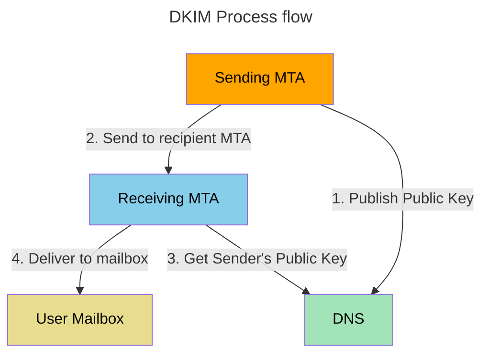

# Configuring DKIM Signing

## What it is

DomainKeys Identified Mail (DKIM) is a mechanism that allows verification of
the source and contents of email messages. Using DKIM, sending domains can
include a cryptographic signature in outgoing email messages. A message's
signature may be verified by an MTA during transit and by the Mail User Agent
(MUA) upon delivery. A verified signature indicates the message was sent by the
sending domain and the message was not altered in transit. When a DKIM
signature fails verification that indicates the message may have been altered
during transit or that the sender is fraudulently using the sending domain
name.

The 2011 DKIM specification is located here:
[rfc6376](https://datatracker.ietf.org/doc/html/rfc6376).

This diagram gives a graphical view of how DKIM works.



### Enabling DKIM signing in KumoMTA

A system administrator with access to manage DNS generates a public/private key
pair to use for signing all outgoing messages for the domain (multiple key
pairs are allowed). The public key is published in DNS, and the private key is
made available to their DKIM-enabled outbound email servers. This is step "1"
in the diagram.

When an email is sent by an authorized user within the domain, the DKIM-enabled
email system uses the stored private key to generate a digital signature of the
message. This signature is included in a DKIM-Signature header and prepended to
the email. The email is then sent on to the recipient's mail server. This is
step "2" in the diagram.


### Generating DKIM Keys

Generate public and private keys for each signing domain and create the DKIM
public key DNS records for those domains.

The OpenSSL cryptography toolkit can be used to generate RSA or Ed25519 keys
for DKIM. The most recent rfc indicates that Ed25519 should be used, but be
aware that Ed25519 DKIM support is currently very limited with most email
services. RSA keys are also supported and are still more widely accepted.
As an example, the following openssl commands are used to generate RSA
public and private keys for the a domain you choose with a selector you
choose. The files can be stored in any directory such as `~/kumomta/keys/`,
but the default is `/opt/kumomta/etc/dkim/`.

Replace the domain and selector with your own, then generate signing keys with:

```console
$ export DOMAIN=<your_domain>
$ export SELECTOR=<your_selector>
$ sudo mkdir -p /opt/kumomta/etc/dkim/$DOMAIN
$ sudo openssl genrsa -f4 -out /opt/kumomta/etc/dkim/$DOMAIN/$SELECTOR.key 1024
$ sudo openssl rsa -in /opt/kumomta/etc/dkim/$DOMAIN/$SELECTOR.key \
    -outform PEM -pubout -out /opt/kumomta/etc/dkim/$DOMAIN/$SELECTOR.pub
$ sudo chown kumod:kumod /opt/kumomta/etc/dkim/$DOMAIN -R
```

Any DKIM verification implementations must support key sizes of 512, 768, 1024,
1536, and 2048 bits. A signer may choose to sign messages using any of these
sizes and may use a different size for different selectors. Larger key sizes
provide greater security but impose higher CPU costs during message signing and
verification. It is not recommended to use a key size lower than 1024 unless
absolutely necessary. Note that Google _requires_ senders to sign with a 1024
bit or greater key size.

The resulting RSA public key should look similar to:

```txt
-----BEGIN PUBLIC KEY-----
MIGfMA0GCSqGSIb3DQEBAQUAA4GNADCBiQKBgQDnkmt7Vty2iLsVCpNCx4+tbufL
xwe+P13AmzYYa9SHIV2Is3G+U4vRlAEg1McK1ssrsjF5GWGSKSeDrYJY06I8ruZS
CpPIHQo85GAkmGbBPHMhZuk8x5XSgI8VkjAZDbiJAwg1U6MV5deWqrzDC8OJ3+RK
KPrbKH5ubT9V9pLKawIDAQAB
-----END PUBLIC KEY-----
```

Once the public and private keys have been generated, create a DNS text record
for `<SELECTOR>._domainkey.<DOMAIN>` (IE: `dkim1024._domainkey.example.com`). The
DNS record contains several DKIM "tag=value" pairs and should be similiar
to the record shown below:

for RSA256:

```txt
default._domainkey.example.com. 86400 IN TXT
"v=DKIM1; k=rsa; h=sha256; p=MIbBa...DaQAB"
```

DKIM DNS text record tags are defined below. Do not include the quotes below
when including a tag value in the DNS text record.

  * `v=` **DKIM key record version**. The value of this tag must be set to "DKIM1".

  * `k=` **Key type**. This tag defines the syntax and semantics of the p= tag
    value. Currently, this tag should have the value "rsa" or "ed25519" as
    appropriate.

  * `h=` **Hash algorithm**. Currently, this tag should have the value "sha1"
    or "sha256" if using RSA.

  * `t=` **Flags**. The only value currently defined is "y". If specified, this
    tag indicates the signing domain is testing DKIM.

  * `p=` *DKIM public key value** generated as described above.

  * `s=` **Service Type**. If specified, this tag should be set to "*" or
    "email" which represents all service types or the email service type.
    Currently, "email" is the only service using this key.

  * `n=` **Notes**. If specified, the value of this tag is quoted-printable
    text used as a note to anyone reading the DNS text record. The tag is not
    interpreted by DKIM verification and should be used sparingly because of
    space limitations of the DNS text record.

## Using the dkim_sign.lua Policy Helper

To simplify DKIM configuration using a TOML configuration file, you can use the
`dkim_sign.lua` policy helper.

The policy helper is configured to look for keys under the default path of
`/opt/kumomta/etc/dkim/DOMAIN/SELECTOR.key` but can be overridden on a
per-domain basis if needed.

To use the policy helper, add the following to your default policy:

```lua
local dkim_sign = require 'policy-extras.dkim_sign'
local dkim_signer = dkim_sign:setup { '/opt/kumomta/etc/dkim_data.toml' }

kumo.on('smtp_server_message_received', function(msg)
  -- SIGNING MUST COME LAST OR YOU COULD BREAK YOUR DKIM SIGNATURES
  dkim_signer(msg)
end)

kumo.on('http_message_generated', function(msg)
  -- SIGNING MUST COME LAST OR YOU COULD BREAK YOUR DKIM SIGNATURES
  dkim_signer(msg)
end)
```

The preceding policy example sets up the `dkim_sign` helper and adds calls for
signing to the events that fire for message arrival. The call to the
`dkim_signer` function much be placed last in the events to ensure that no
further manipulation of the messages occur after signing.

In addition create and populate the configured `dkim_data.toml` file, located
at `/opt/kumomta/etc/dkim_data.toml` in this example.

```toml
[base]
# If these are present, we'll use hashicorp vault instead
# of reading from disk
vault_mount = "secret"
vault_path_prefix = "dkim/"

# To do double or triple signing, add each additional
# signature name to this list and see the `signature."MyESPName"`
# block below
additional_signatures = ["MyESPName"]

# Default selector to assume if the domain/signature block
# doesn't specify one
selector = "dkim1024"

# The default set of headers to sign if otherwise unspecified
headers = ["From", "To", "Subject", "Date", "MIME-Version", "Content-Type", "Sender"]

# Domain blocks match based on the sender domain of the
# incoming message
[domain."example.com"]
selector = 'dkim1024'
headers = ["From", "To", "Subject", "Date", "MIME-Version", "Content-Type", "Sender"]
algo = "sha256" # or "ed25519". Omit to use the default of "sha256"

# optional overridden filename.
# Default is "/opt/kumomta/etc/dkim/DOMAIN/SELECTOR.key"
filename = "/full/path/to/key."

# TODO: reception-time policy for signing based on DNS.
policy = "TempFailIfNotInDNS" # Reject
#policy = "SignAlways"         # Sign and relay
#policy = "SignOnlyIfInDNS"    # Don't sign. Allow fallback to additional_signatures

# The signature block is independent of the sender domain.
# They are consulted based on the value of `base.additional_signatures`
# above.
# In addition to the same values that are found in the `domain` block,
# the following keys are supported
[signature."MyESPName"]
# Policy is interpreted differently for these
policy = "Always" # Always add this signature
#policy = "OnlyIfMissingDomainBlock" # Use this as a fallback

# specifies the signing domain for this signature block
domain = "myesp.com"
```

## Implementing DKIM Signing

Configure KumoMTA to sign emails passing through the MTA with DKIM signatures.
This is done with Lua in policy.  The sample `init.lua` policy provided with
KumoMTA declairs a basic working DKIM signer that you can copy and modify as
needed.  This signs a message with `RSA256` using a selector named `default` on
headers `From`, `To`, and `Subject` using the DKIM key located at
example-private-dkim-key.pem. ([More
documentation](../../reference/kumo.dkim/rsa_sha256_signer.md))

```lua
local signer = kumo.dkim.rsa_sha256_signer {
  domain = msg:from_header().domain,
  selector = 'default',
  headers = { 'From', 'To', 'Subject' },
  file_name = 'example-private-dkim-key.pem',
}
```

Where you want to enable dkim signing, simply call that signer in policy.

IE:  `msg:dkim_sign(signer)`
