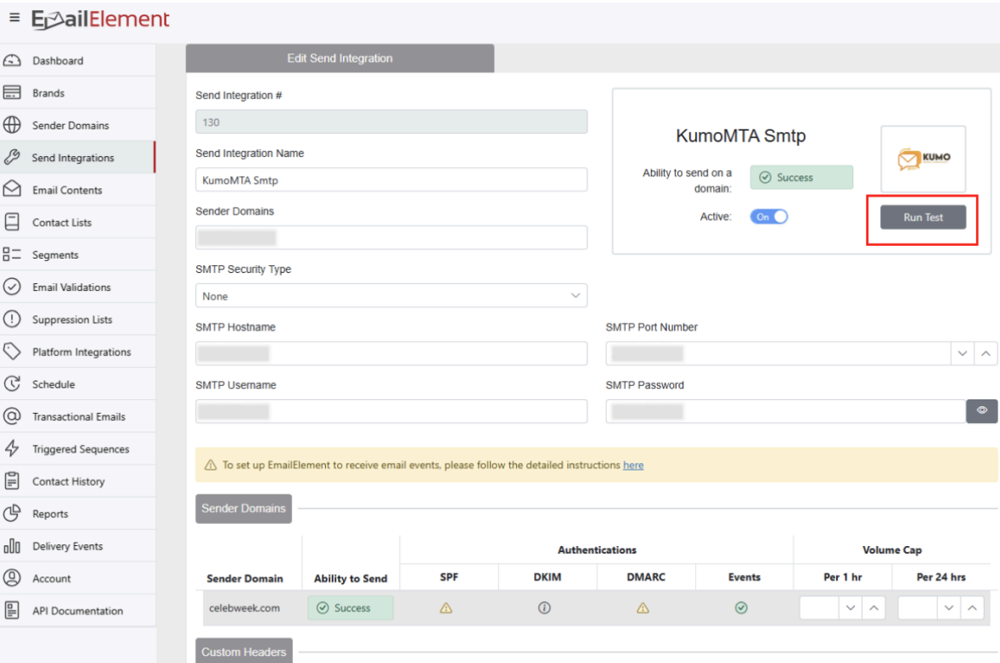

# EmailElement KumoMTA Integration

## Introduction
EmailElement is an all-in-one email email marketing solution where you can build your marketing campaigns from the ground up across multiple brands and mail channels. One of the mail channels supported is KumoMTA. These instructions will show you how to set up your KumoMTA server with EmailElement.

## Instructions

1. Sign up for EmailElement account at the portal, selecting a tier that works best for you.

    [https://portal.emailelement.com/signup](https://portal.emailelement.com/signup)

    Be sure to “Confirm Registration” after you sign up from the email you will receive.
2. Log in after you have confirmed your registration, and set-up a Brand and Sender Domain. If you need help with any of those items you can find some documentation on it [here](https://app.guidde.com/share/playlists/wkMVASZnJ82Af5EL6YmEny?active=0).
3. Go to `Send Integrations` from the navigation menu and select `Create Send Integration`.
4. Select `SMTP` from the `Type of Integration` dropdown, then choose Kumo and proceed.
5. Enter the required fields and save your integration.
6. Click `Run Test` to ensure everything is set-up correctly and you’ll be ready to start sending!

