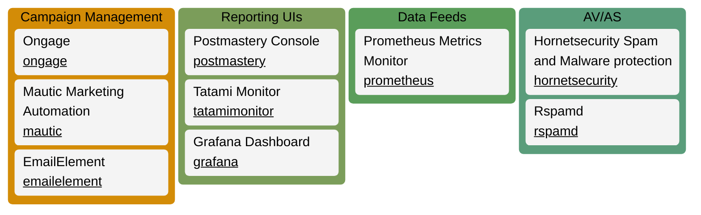

# Integrations

This chapter is focused on partner and adjacent systems integrations.
Some of the third-party integrations could involve a separate external fee, while others are entirely FOSS (Free and Open Source Software).

We are available to provide paid professional services to assist you with any of these integrations.

