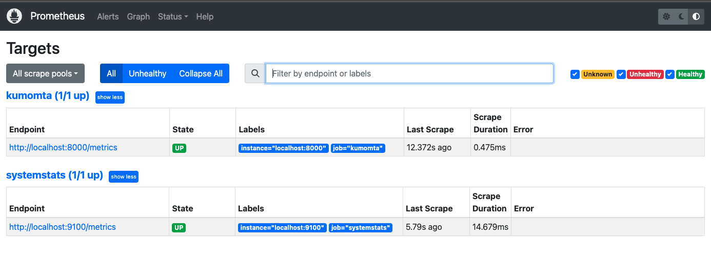

# Observability with Prometheus 

## Introduction 

[Prometheus](https://prometheus.io/) is an open-source systems monitoring and alerting toolkit originally built at [SoundCloud](https://soundcloud.com/). Prometheus collects and stores its metrics as time series data, i.e. metrics information is stored with the timestamp at which it was recorded, alongside optional key-value pairs called labels. 

## Instructions 

### Get KumoMTA 

Install KumoMTA as per the installation instructions [here](https://docs.kumomta.com/userguide/installation/overview/) 

Before finishing this step, you should ensure that you have correctly set up DNS with a resolving sending domain, MX, PTR, SPF, DKIM, etc.   

Ensure that you can inject and deliver mail before proceeding. 

 

### Get Prometheus 

First, **Install Node-Exporter** to collect typical system metrics to push to Prometheus. If you are configuring a cluster, node-exporter should be installed on each node.   

There is also a very handy step-by-step guide [here](https://prometheus.io/docs/guides/node-exporter/) 

```bash
cd  
wget https://github.com/prometheus/node_exporter/releases/download/v1.6.0/node_exporter-1.6.0.linux-amd64.tar.gz 
tar xvfz node_exporter-*.*-amd64.tar.gz 
cd node_exporter-*.*-amd64 
./node_exporter & 
``` 

This leaves the process running so press RETURN / Hit ENTER.  You will probably want to add that to your start up processes. 

You can test this with a simple curl : `curl http://localhost:9100/metrics` 

 
Now, **Install Prometheus** for system reporting. Get an appropriate version from [here](https://prometheus.io/download/). Theoretically this can be set up on a remote server to collect metrics from your whole cluster.  In this document we will install version 2.47.2 on localhost. 
 
```bash
cd 
wget https://github.com/prometheus/prometheus/releases/download/v2.47.2/prometheus-2.47.2.linux-amd64.tar.gz 
tar xvf prometheus-*.*-amd64.tar.gz 
cd prometheus-2.47.2.linux-amd64/ 
```

Create or modify a Prometheus yaml file so it includes this node’s feed.  If you are configuring a cluster, add references to all the nodes here too.  This can be saved almost anywhere.  The command below creates the file in `./myprometheus.yml`. The job name `kumomta` will collect email metrics using the metrics API. The job name `systemstats` will collect OS and machine metrics. 
 

```bash
echo " 
global: 
   scrape_interval: 15s 
scrape_configs:  
  - job_name: 'kumomta' 
    static_configs: 
      - targets: ['localhost:8000'] 
  - job_name: 'systemstats' 
    static_configs: 
      - targets: ['localhost:9100'] 
" > ./myprometheus.yml
```  


Now start it with the yaml file mentioned above: 

 `./prometheus --config.file=./myprometheus.yml` 
 

You should now be able to access and manage data sources in the Prometheus webUI on port 9090. Node metrics will use port 9100 internally to feed data to Prometheus. 

Remember to update your firewall to securely access port 9090 

The UI is wide open by default so take measures to lock down access with usual network tools. 

If you have done this all correctly, you should be able to access the target status with ` http://<your_domain>:9090/targets ` in the Prometheus webUI.  The result should look something like this: 


 

