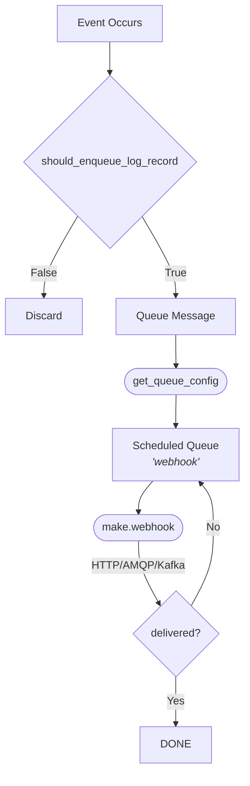

# The Performance Implications of Log Hooks

KumoMTA supports the use of [webhooks](../operation/webhooks.md) for the delivery of log events, as well as routing events via [AMQP](../policy/amqp.md) and [Kafka](../policy/kafka.md).

It is important to understand the flow of log hooks to be able to optimize its performance.



The **key concept** in this flow is that when you enable shipping logs via HTTP/AMQP/Kafka _the log events will be queued in the server queues alongside messages to be delivered_.

This means that when planning server capacity you must take into account the events that will be associated with each message and count them toward the capacity goal.

For example: if your target is to relay 1,000,000 messages per hour through a server, and you plan on delivering log data via HTTP as webhooks, and you estimate that on average each message will have three log events (receiption, one transient failure (4xx), and one delivered or permanent failure (5XX)), then your required server throughput is actually 4,000,000 messages per hour. Inversely, if your server is designed to relay 1,000,000 messages per hour it will in fact only be able to relay 250,000 outbound messages and 750,000 log events.

## Traffic Shaping For Log Queues

KumoMTA's default traffic shaping rules are configured to prevent reputation damage when sending by respecting the expectation of MailBox Providers(MBPs).

While those defaults can help prevent throttling, they are overly restrictive when sending messages to internal HTTP/AMQP/Kafka endpoints, and can result is queue backpressure.

To prevent queue buildup, your traffic shaping configuration should explicitly define shaping rules for your webhook queue.

Consider the following log hook configuration:

```lua
local log_hooks = require 'policy-extras.log_hooks'

-- Send a JSON webhook to a local network host.
-- See https://docs.kumomta.com/userguide/operation/webhooks/
log_hooks:new_json {
  name = 'webhook',
  url = 'http://10.0.0.1:4242/log',
  log_parameters = {
    headers = { 'Subject', 'X-Customer-ID' },
  },
}
```

Given the log hook name of `webhook` the following should be added to the shaping helper TOML configuration file:

```toml
['webhook.log_hook']
# This is not a regular email domain, so do not try to resolve it as an MX record
mx_rollup = false
max_deliveries_per_connection = 8192
# No need to coordinate with other MTAs on a shared limit
connection_limit = "local:10"
max_connection_rate = "1000/s"
# Allow a healthy amount in the ready queue in case things get busy
max_ready = 10000
# Limit how long we wait for connections to close at shutdown so we don't delay unneccessarily
system_shutdown_timeout = "30s"
```

While these settings can be adjusted to best fit your use cases, the example above will be a good starting point.

## Batching Webhooks

By default KumoMTA will deliver log messages to a webhook endpoint one entry at a time.

In some implementations a webhook consumer may be more efficient when receiving batching of webhook events instead of individual events (one example is webhook consumers that simply write data to storage without processing). 

To activate batch sending, see the [log hooks helper](../operation/webhooks.md#batched-hooks) page of the Operation chapter.
