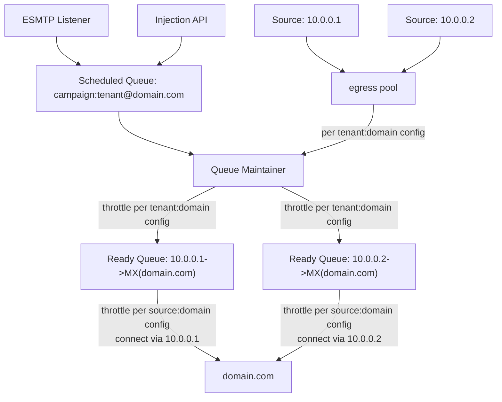

# Understanding Message Flows
Most KumoMTA performance tuning is going to involve tuning the flow of messages through KumoMTA and how each stage of the flow can affect performance. This involves understanding both how the queues work as well as the various processing that occurs.

## Queue Flow
First let's review how messages flow through the queues in KumoMTA. This is covered in more detail in the [Queues chapter of the reference manual](../../reference/queues.md) but will be summarized here.

1) A message is injected into the KumoMTA server. Either the `smtp_server_message_received` or `http_message_generated` event will fire and code attached to the corresponding hook will be executed. 

  * The most common action executed at this stage is [DKIM signing](../configuration/dkim.md), performed either through the `dkim_sign.lua` helper or by calling `msg:dkim_sign()` in lua.

  * Those using the [queues helper](../configuration/queuemanagement.md) will call `queue_helper:apply()` at this point.

  * A log entry will be generated for the message reception event. 

!!! Note 
    If you have configured [log hooks](../operation/webhooks.md) or routing logs via [AMQP](../policy/amqp.md) or [Kafka](../policy/kafka.md) then a message will be queued for each log entry that needs to be routed. This means that each message injected will result in multiple messages in the queues (at least one message for the Received log entry and one for the Delivered log entry).

2) The message is assigned into a Scheduled Queue based on the combination of its **campaign,** **tenant,** and destination **domain**. If there is no defined campaign or tenant, the message is placed in a queue based on the elements that are present.

  * At this point there will potentially be thousands of scheduled queues depending on the number of tenants, campaigns, and destination domains involved. Note that egress_source, site_name, and provider are not factored into this queue architecture.

3) The KumoMTA server moves the message from the Scheduled Queue into the Ready Queue based on retry intervals configured for the Standby Queue. The Ready Queue will be defined as a combination of the *Egress_Source* to be used for the message and the *Site_Name* the destination domain belongs to. If a message is on its first attempt, it will be moved to the Ready Queue immediately.

  * As part of this process the appropriate ready queue will be compared to the corresponding [max_ready](../../reference/kumo/make_egress_path/max_ready.md) setting to ensure there is room for the message. If there is not the message will be delayed by a random amount, returned to the Scheduled queue, and a [`Delayed`](../../reference/log_record.md#record-types) log entry will be generated (potentially with a corresponding queued message to route the log entry over Webhook/AMQP/Kafka).
  
  * Traffic shaping and other similar options are configured based on this combination, see the [Configuring Traffic Shaping](../configuration/trafficshaping.md) chapter for more information.

  * The **egress source** is a configured structure that defines the name, source IP, and ehlo domain of a given pathway, and it is added to an egress pool, which the message is assigned to as part of the queue config. **Note:** While routing is assigned at the *egress pool* level, traffic shaping happens at the *egress source* level.

  * The **site name** is an identifier string created by merging the combined MX hostnames for a given destination domain. This approach allows the server to queue and throttle based not on the destination domain for a given message, but on the aggregate of all domains that share the same set of MXes.

5) All delivery attempts are logged, and any messages that receive a 4xx tempfail response from the remote host are returned to the Scheduled Queue to await a retry attempt. See the [Configuring Logging](../configuration/logging.md) chapter for more information on logging.